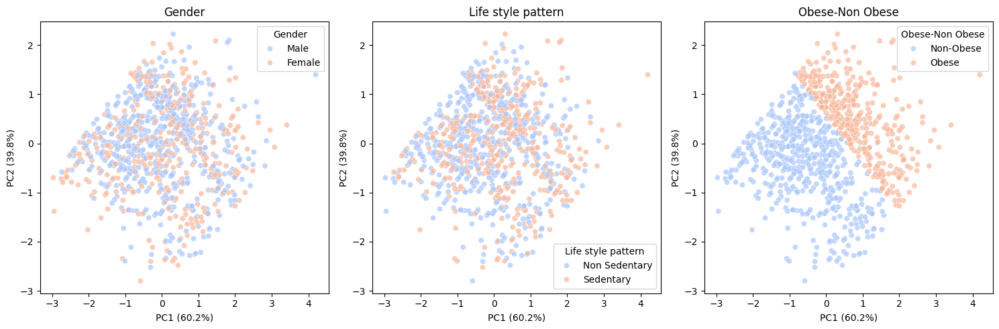

# gut_microbiome_index
This repository contains the scripts and an algorithm for clustering gut microbiome compositions using dimensionality reduction and various feature selection techniques. This project focuses on clustering microbioal populations and visualizing their structures using various ML models. 

# Introdcution 

<p align="center">
  
</p>

## Installation

This script need no installation, but has the following requirements:
* PyTorch 0.4.1 or above
* Python 3.6.5 or above
* Captum

## Usage

## Input data formats

* gut microbe data (genes by patients): a csv file with n rows and m columns. n is the number of paitents and m is the features

* otu data: an csv file includes the expression levels of gut microbes of patients. 

# Working and code flow
The example data is downloaded from the publicly accessible dataset[3] which is including gene expression data and clinical information of non-small cell lung cancer (NSCLC) patients. And we approached the researchers for the csv files.

```python


import pandas as pd
import numpy as np

def load_data(otu_file, taxonomy_file, metadata_file):
    otu = pd.read_csv(otu_file, index_col=0)
    taxonomy = pd.read_csv(taxonomy_file, index_col=0)
    metadata = pd.read_csv(metadata_file, index_col=0)
    return otu, taxonomy, metadata


def filter_top_species(otu, top_n=30):
    otu_top = otu.apply(lambda x: x.nlargest(top_n).fillna(0), axis=1)
    return otu_top

def compute_diversity_indices(otu):
    diversity_df = pd.DataFrame({
        'Shannon_Index': otu.apply(shannon, axis=1),
        'Simpson_Index': otu.apply(simpson, axis=1)
    })
    return diversity_df


# run the clustering algorithm 

from sklearn.preprocessing import StandardScaler
from sklearn.cluster import DBSCAN
from scipy.spatial.distance import pdist, squareform
from skbio.diversity.alpha import shannon, simpson
import seaborn as sns
import matplotlib.pyplot as plt
from sklearn.metrics import silhouette_score, davies_bouldin_score
from sklearn.decomposition import PCA

def apply_dbscan_clustering(data, metric='braycurtis', eps=0.5, min_samples=5):
    distance_matrix = squareform(pdist(data, metric=metric))
    clustering = DBSCAN(eps=eps, min_samples=min_samples, metric='precomputed').fit(distance_matrix)
    return clustering.labels_

def evaluate_clusters(data, labels):
    if len(set(labels)) > 1 and -1 not in set(labels):  # Ensure valid clusters exist
        silhouette = silhouette_score(data, labels, metric='euclidean')
        db_index = davies_bouldin_score(data, labels)
        return {'Silhouette Score': silhouette, 'Davies-Bouldin Index': db_index}
    return {'Silhouette Score': None, 'Davies-Bouldin Index': None}

def visualize_clusters(data, labels, metadata):
    pca = PCA(n_components=2)
    pca_result = pca.fit_transform(StandardScaler().fit_transform(data))

    df = pd.DataFrame(pca_result, columns=['PC1', 'PC2'])
    df['Cluster'] = labels
    df = df.merge(metadata, left_index=True, right_index=True)


# Lasso for feature selection

import pandas as pd
import numpy as np
import matplotlib.pyplot as plt
import seaborn as sns
from sklearn.preprocessing import StandardScaler
from sklearn.linear_model import Lasso
from sklearn.feature_selection import SelectFromModel
from sklearn.model_selection import train_test_split
from sklearn.metrics import mean_squared_error

# Load
pan_meta = pd.read_csv("/content/pan_meta.csv")
pan_otutab = pd.read_csv("/content/pan_otutab.csv")

pan_meta.columns = pan_meta.columns.str.strip()
pan_otutab.columns = pan_otutab.columns.str.strip()

print("Columns in pan_otutab:", pan_otutab.columns)
print("Columns in pan_meta:", pan_meta.columns)

if "Subject_ID" not in pan_otutab.columns or "Subject_ID" not in pan_meta.columns:
    print("Column name mismatch. Checking similar names...")


    subject_col_otutab = [col for col in pan_otutab.columns if "subject" in col.lower()]
    subject_col_meta = [col for col in pan_meta.columns if "subject" in col.lower()]

    if subject_col_otutab and subject_col_meta:
        print(f"Renaming {subject_col_otutab[0]} and {subject_col_meta[0]} to 'Subject_ID'")
        pan_otutab.rename(columns={subject_col_otutab[0]: "Subject_ID"}, inplace=True)
        pan_meta.rename(columns={subject_col_meta[0]: "Subject_ID"}, inplace=True)
    else:
        raise ValueError("Could not find matching subject ID columns in both datasets.")

pan_otutab["Subject_ID"] = pan_otutab["Subject_ID"].astype(str)
pan_meta["Subject_ID"] = pan_meta["Subject_ID"].astype(str)

print("Unique Subject_IDs in OTU table:", pan_otutab["Subject_ID"].nunique())
print("Unique Subject_IDs in Metadata:", pan_meta["Subject_ID"].nunique())


common_subjects = set(pan_otutab["Subject_ID"]).intersection(set(pan_meta["Subject_ID"]))
print(f"Number of common Subject_IDs: {len(common_subjects)}")
merged_data = pan_otutab.merge(pan_meta, on="Subject_ID", how="inner")

print("Merged dataset shape:", merged_data.shape)
merged_data = pan_otutab.merge(pan_meta, on="Subject_ID", how="inner")

# Identifying the num parameter
numerical_targets = pan_meta.select_dtypes(include=[np.number]).columns.tolist()
if "Subject_ID" in numerical_targets:
    numerical_targets.remove("Subject_ID")


corr_matrix = merged_data.corr()
plt.figure(figsize=(12, 8))
sns.heatmap(corr_matrix, cmap="coolwarm", annot=False, fmt=".2f")
plt.title("Correlation Heatmap")
plt.show()

print("Columns in merged_data:", merged_data.columns.tolist())
print("Numerical targets:", numerical_targets)
print("Dropping columns:", [col for col in numerical_targets if col in merged_data.columns] + ["Subject_ID"])
otu_data = merged_data.drop(columns=numerical_targets + ["Subject_ID"], errors="ignore")
otu_data = otu_data.apply(pd.to_numeric, errors="coerce")
otu_data.fillna(0, inplace=True)

otu_data = merged_data.drop(columns=[col for col in numerical_targets if col in merged_data.columns] + ["Subject_ID"], errors="ignore")
scaler = StandardScaler()
X_scaled = scaler.fit_transform(otu_data)
X_scaled_df = pd.DataFrame(X_scaled, index=otu_data.index, columns=otu_data.columns)
print("Scaling completed successfully.")


common_indices = merged_data.dropna(subset=numerical_targets).index
X_filtered = X_scaled_df.loc[common_indices]
y_filtered = merged_data.loc[common_indices, numerical_targets]

# Feature selection
selector = SelectFromModel(Lasso(alpha=0.1, max_iter=10000))
X_reduced = selector.fit_transform(X_filtered)

#TT Split
X_train, X_test, y_train, y_test = train_test_split(X_reduced, y_filtered, test_size=0.2, random_state=42)

# LASSO
lasso_results = {}
lasso = Lasso(alpha=0.1, max_iter=10000)

for target in numerical_targets:
    y_target = y_train[target]

    lasso.fit(X_train, y_target)

    y_pred = lasso.predict(X_test)
    mse = mean_squared_error(y_test[target], y_pred)
    important_features = {otu: coef for otu, coef in zip(X_filtered.columns[selector.get_support()], lasso.coef_) if coef != 0}

    lasso_results[target] = {
        "MSE": mse,
        "Important OTUs": important_features
    }

# RESULT
for target, result in lasso_results.items():
    print(f"\nLasso Regression for {target}")
    print(f"MSE: {result['MSE']:.4f}")
    print("Important OTUs:")
    for otu, coef in sorted(result['Important OTUs'].items(), key=lambda x: -abs(x[1]))[:10]:  # Show top 10 OTUs
        print(f"  {otu}: {coef:.4f}")

